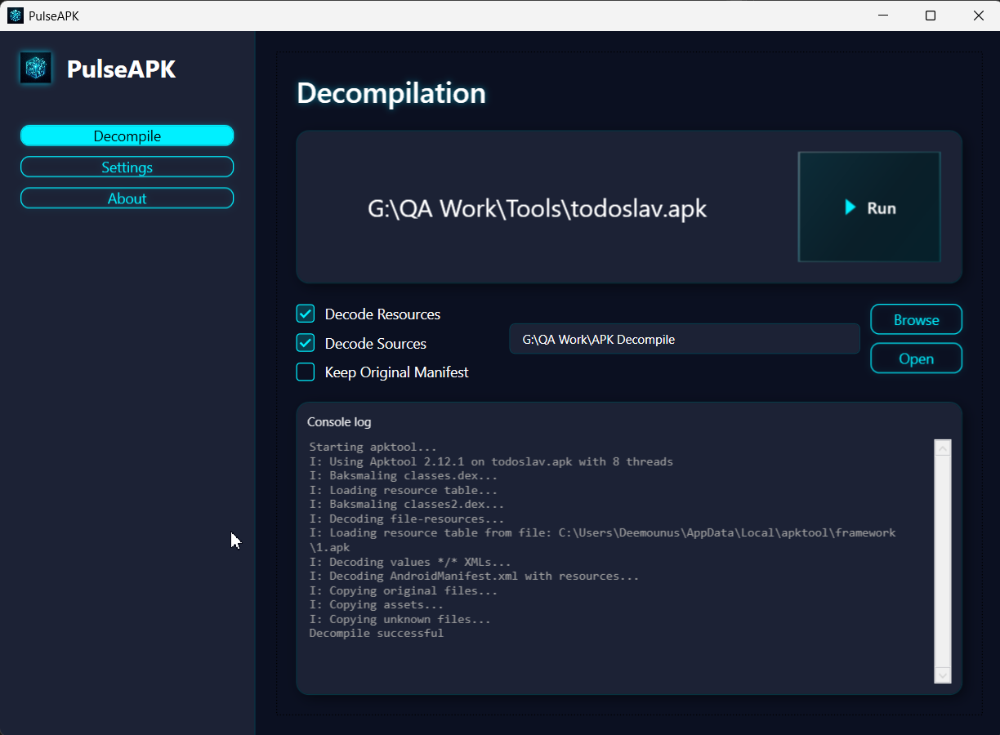

# PulseAPK

**PulseAPK** is a modern, reliable, and user-friendly GUI wrapper for `apktool` built with WPF (Windows Presentation Foundation) and .NET 8. It wraps the powerful command-line utility with a sleek cyberpunk-inspired interface, making decompilation effortless for both beginners and professionals.



[Watch the demo on Youtube](https://youtu.be/yxqQjJZ4Obc)

## Key Features

- **🚀 Sleek Interface**: A modern dark-themed UI that feels right at home on your desktop.
- **📁 Drag & Drop Support**: Simply drag and drop your APK files to start working.
- **⚡ Safe & Secure**: Validates files before processing and prevents accidental overwrites of critical system folders.
- **🔧 Configurable**: Set your own path to `apktool.jar` and manage your workspace settings easily.
- **📜 Live Logging**: Watch the decompilation process in real-time with a built-in console viewer.
- **🧩 Compilation Support**: Rebuild modified projects back into APKs directly from the app.

## Prerequisites

Before running **PulseAPK**, ensure you have the following:

1.  **Java Runtime Environment (JRE)**: `apktool` requires Java. Make sure `java` is added to your system `PATH`.
2.  **Apktool**: Download the latest `apktool.jar` from [ibotpeaches.github.io](https://ibotpeaches.github.io/Apktool/).
3.  **.NET 8.0 Runtime**: Required to run the application on Windows.

## Quick Start Guide

1.  **Download and Build**
    Clone the repository and build the project:
    ```powershell
    dotnet build
    dotnet run
    ```

2.  **First-Time Setup**
    - Go to the **Settings** tab.
    - Click **Browse** under "Apktool Path" and select your downloaded `apktool.jar`.
    - (*Optional*) Verify that the App detects your Java installation.

3.  **Decompile an APK**
    - Drag your `.apk` file into the main window, or click **Browse** to select one.
    - Choose your desired **Output Folder**.
    - Configure options like **Decode Resources** or **Decode Sources**.
    - Click **Run Decompile**.
    - Monitor progress in the console window below.

4.  **Recompile an APK**
    - Open your edited project folder in the **Compilation** tab.
    - Specify the output location for the rebuilt APK.
    - Click **Run Compile** to generate a new APK and follow progress via the console.

## Technical Details

**PulseAPK** follows the MVVM (Model-View-ViewModel) architectural pattern for clean code separation and testability.

### Project Structure

- **PulseAPK.csproj**: Main project file targeting `.NET 8.0-windows`.
- **Views/**: XAML user controls (`DecompileView`, `SettingsView`, `AboutView`).
- **ViewModels/**: Logic and data binding (`DecompileViewModel`, `MainViewModel`, etc.).
- **Services/**: Core logic adapters (`ApktoolRunner`, `SettingsService`, `FilePickerService`).
- **Utils/**: Helper classes for validation and path management.

### Troubleshooting

- **Crash on Start**: Ensure you have the latest .NET 8 Desktop Runtime installed.
- **"Apktool not found"**: Go to Settings and ensure the path to `apktool.jar` is correct.
- **"Java not found"**: Ensure `java.exe` is in your environment variables.

## License

This project is open-source and available under the [MIT License](LICENSE.md).
