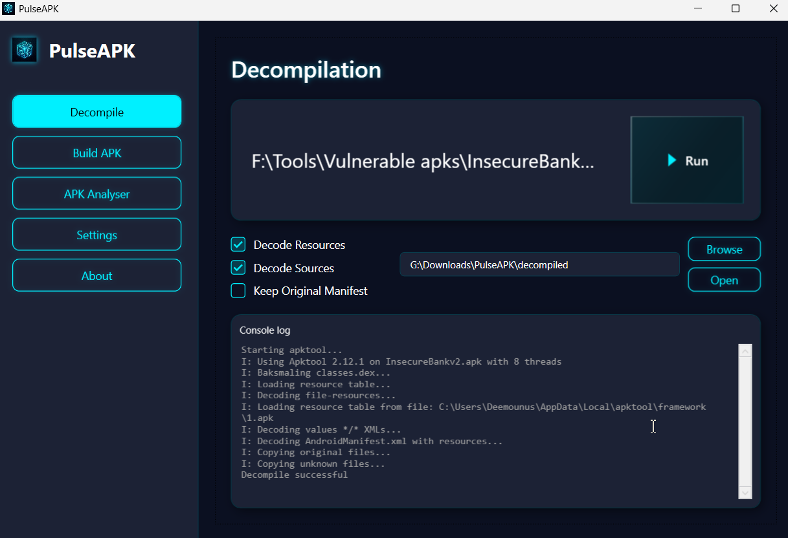
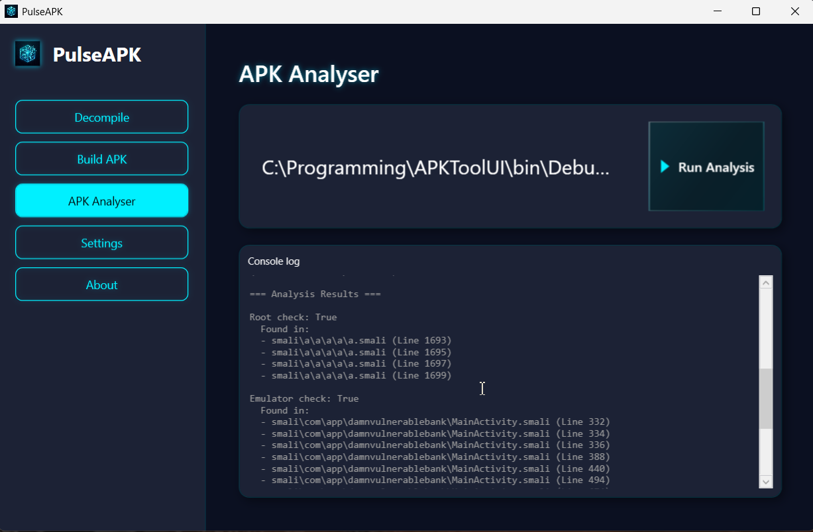
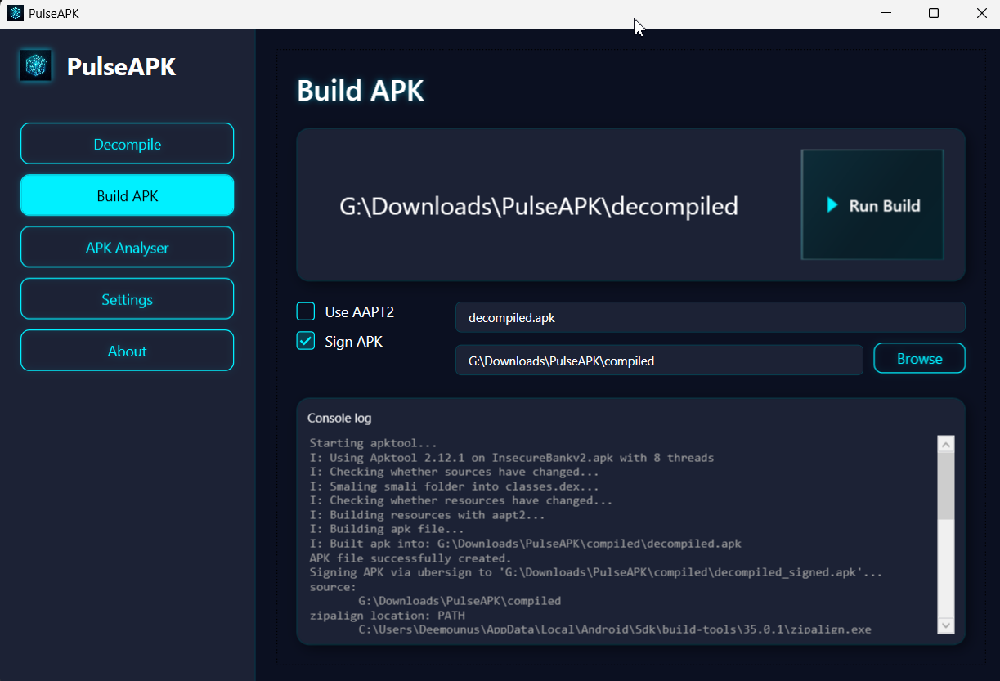

# PulseAPK

**PulseAPK** 是一款专业级 Android 逆向与安全分析 GUI，基于 WPF 和 .NET 8 构建。它将 `apktool` 的强大能力与高级静态分析功能结合，并以高性能赛博朋克风格界面呈现。PulseAPK 从反编译到分析、重建与签名，贯穿整个工作流。

[观看 YouTube 演示](https://youtu.be/Mkdt0c-7Wwg)



你还可以进行 Smali 代码分析。只需将 Smali 文件夹拖放到 Analysis 标签页。



如果要构建（并在必要时签名）Smali 文件夹，请使用 “Build APK” 部分。



## 关键特性

- **🛡️ 静态安全分析**：自动扫描 Smali 代码中的漏洞，包括 root 检测、模拟器检测、硬编码凭据以及不安全的 SQL/HTTP 使用。
- **⚙️ 动态规则引擎**：通过 `smali_analysis_rules.json` 完全可定制分析规则。无需重启应用即可实时修改检测模式，并使用缓存提升性能。
- **🚀 现代 UI/UX**：响应式深色界面，专为效率设计，支持拖放与实时控制台反馈。
- **📦 全流程一体化**：在统一环境中完成 APK 的反编译、分析、编辑、重新编译与签名。
- **⚡ 安全可靠**：包含智能校验与崩溃预防机制，保护工作区与数据。
- **🔧 完全可配置**：轻松管理工具路径（Java、Apktool）、工作区设置与分析参数。

## 高级能力

### 安全分析
PulseAPK 内置静态分析器，可扫描反编译代码中的常见安全指标：
- **Root 检测**：识别对 Magisk、SuperSU 以及常见 root 二进制的检查。
- **模拟器检测**：查找 QEMU、Genymotion 以及特定系统属性的检测。
- **敏感数据**：扫描硬编码的 API key、token 与 basic auth 头。
- **不安全网络**：标记 HTTP 使用与潜在数据泄露点。

*规则定义在 `smali_analysis_rules.json` 中，可按需定制。*

### APK 管理
- **反编译**：轻松解码资源与源代码，支持可配置选项。
- **重新编译**：将修改后的项目重建为有效 APK。
- **签名**：集成 keystore 管理，为重建 APK 进行签名，确保可在设备上安装。

## 前置条件

1.  **Java Runtime Environment (JRE)**：`apktool` 需要它。确保 `java` 在系统 `PATH` 中。
2.  **Apktool**：从 [ibotpeaches.github.io](https://ibotpeaches.github.io/Apktool/) 下载 `apktool.jar`。
3.  **Ubersign (Uber APK Signer)**：用于签名重建 APK。请从 [GitHub releases](https://github.com/patrickfav/uber-apk-signer/releases) 下载最新版 `uber-apk-signer.jar`。
4.  **.NET 8.0 Runtime**：在 Windows 上运行 PulseAPK 所需。

## 快速开始指南

1.  **下载并构建**
    ```powershell
    dotnet build
    dotnet run
    ```

2.  **设置**
    - 打开 **Settings**。
    - 指定 `apktool.jar` 路径。
    - PulseAPK 将根据环境变量自动检测你的 Java 安装。

3.  **分析 APK**
    - 在 Decompile 标签页 **反编译** 目标 APK。
    - 切换到 **Analysis** 标签页。
    - 选择反编译后的项目文件夹。
    - 点击 **Analyze Smali** 生成安全报告。

4.  **修改与重建**
    - 编辑项目文件夹中的文件。
    - 使用 **Build** 标签页重建新的 APK。
    - 使用 **Sign** 标签页为输出 APK 签名。

## 技术架构

PulseAPK 使用清晰的 MVVM（Model-View-ViewModel）架构：

- **Core**：.NET 8.0，WPF。
- **Analysis**：基于正则表达式的自定义静态分析引擎，规则可热重载。
- **Services**：专用服务用于 Apktool 交互、文件系统监控与设置管理。

## 许可证

本项目为开源项目，遵循 [Apache License 2.0](LICENSE.md)。

### ❤️ 支持项目

如果 PulseAPK 对你有帮助，可以点击顶部的 “Support” 按钮支持其开发。

给仓库点星也非常有帮助。

### 贡献

我们欢迎贡献！请注意，所有贡献者必须签署 [Contributor License Agreement (CLA)](CLA.md)，以确保其工作可合法分发。
提交 pull request 即表示你同意 CLA 条款。
